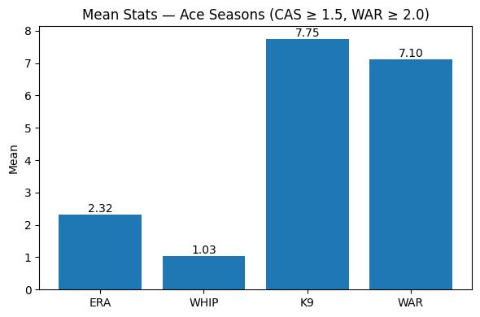
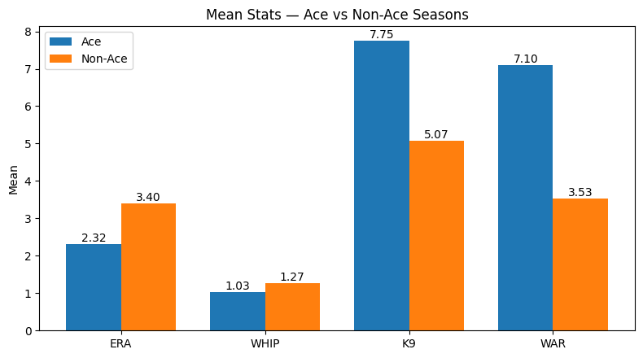
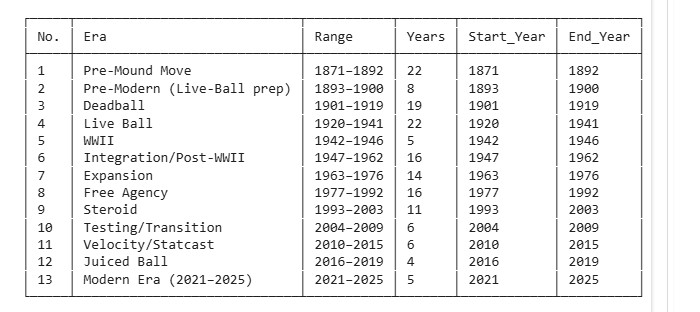
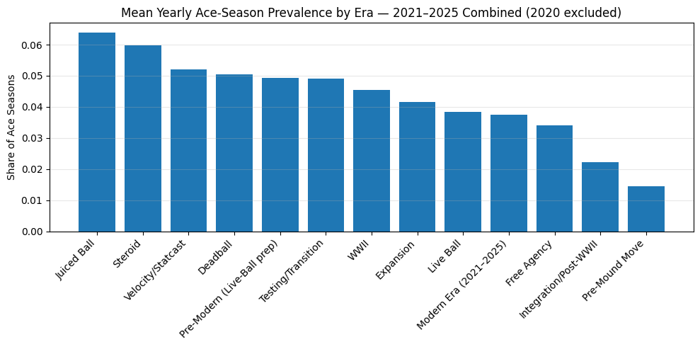
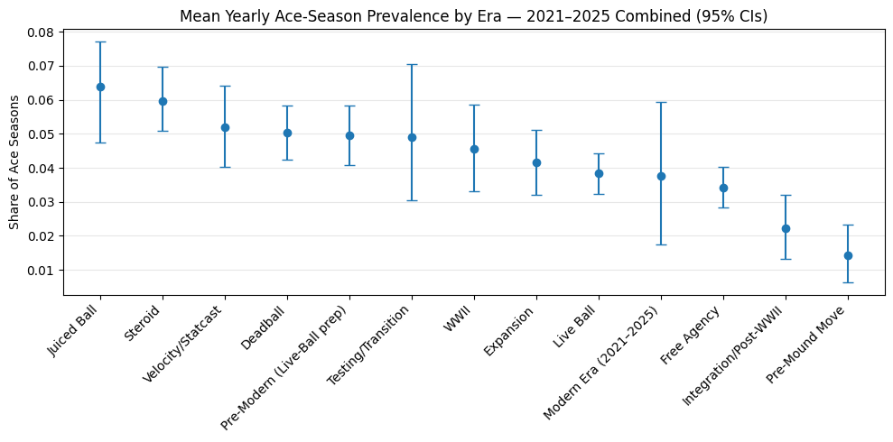
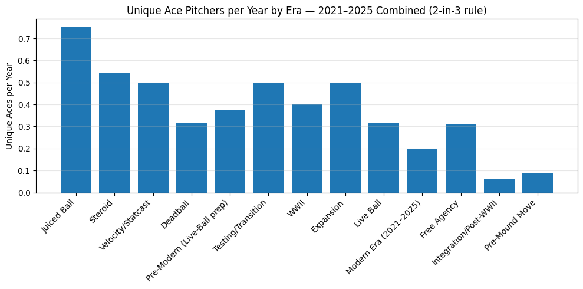
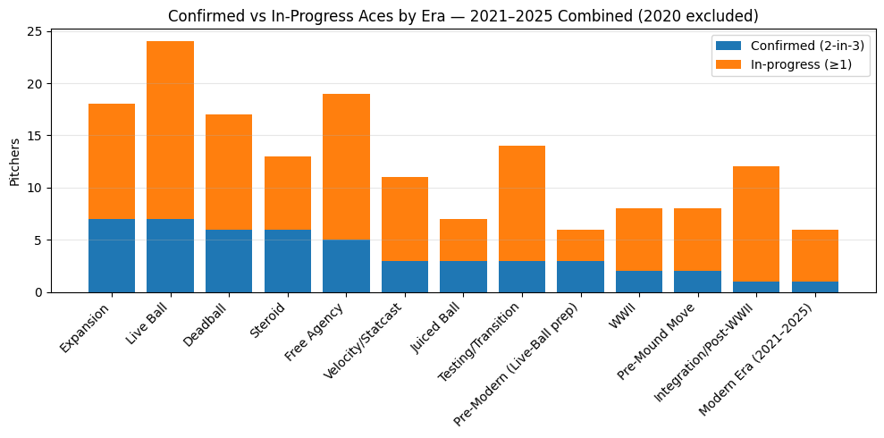
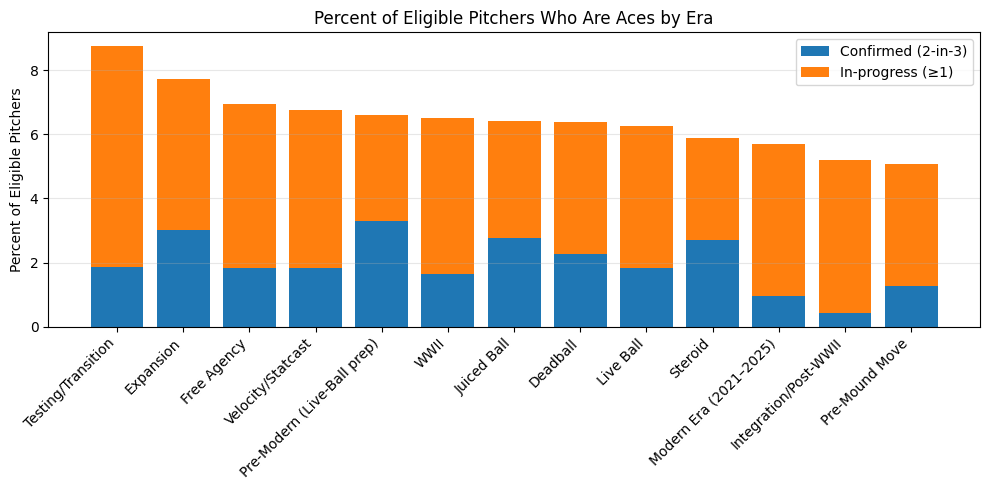

# Aces_article

When I was a kid, Opening Day felt like a duel of No. 1s, and October meant handing the ball to the same horse in Games 1 and 7. Names like **Pedro Martínez**, **Roger Clemens**, **Curt Schilling**, and **Greg Maddux** didn’t just pitch; they set the calendar. That’s the picture of an **ace** I grew up with.

Today the shape of pitching is different. Rotations run six or seven deep, starters throw fewer innings, and true separation at the top is rarer. The numbers hint at it: in the **Juiced Ball** years (2016–2019), roughly **6–7%** of eligible starter-seasons graded as ace years; since **2021**, it’s closer to **~3–4%**. So is this a real ace drought—or did the game change what an ace looks like?

To find out, I’m treating “ace” like a measurable claim, not a vibe: a year-relative composite of **ERA, WHIP, K/9, and WAR**, with a simple workload floor, applied within each season’s context. The question isn’t just *who feels like an ace*, but **how often ace-level seasons actually happen**—and how many pitchers can repeat them. If the modern game truly flattens the top, the data should show it.

## Step 1) How I Define (and Validate) an “Ace”

I didn’t want to define an ace by feel. I wanted a bar that says, with numbers, “this pitcher was truly better than his peers.” So I define an **Ace Season** as a year where a starter dominates his **own season’s** context across four core stats—**ERA, WHIP, K/9, and WAR**. I standardize each stat **within the same year** (so run environment and league-wide strikeout trends don’t skew things), flip ERA/WHIP so lower values become better, and average the four z-scores into one number: the **Composite Ace Score (CAS)**. I also impose a **workload floor** of **WAR ≥ 2.0** so tiny, fluky seasons don’t sneak in. With that setup, a season is an **Ace Season** if **CAS ≥ 1.5**. Intuitively, **CAS = +1.5** means the pitcher is about **1.5 standard deviations better than his peers on the combined scale**.

Here’s the quick proof that this definition works:

Out of **7,030** pitcher-seasons, about **4%** (roughly **1 in 24**) clear the ace bar. If you’re an ace this year, you have about a **44%** chance of being an ace again in the next 1–2 seasons; if you’re not, it’s about **4%**—a **~12×** difference. The score also points forward: pitchers with a high CAS are **~3×** more likely to land in the **top 10%** by WAR the next year (in other words, it’s good at telling who will be great). It isn’t just sneaking WAR back in either—using only **ERA/WHIP/K/9** still lines up with value pretty well. And when I raise or lower the bar, the results move sensibly (**~6.5%**, **4.2%**, **2.3%** at easier/standard/stricter settings) without breaking the pattern. Bottom line: the line is **strict**, **fair to each season**, and **actually predictive**.

### What does an ace pitcher look like? 

  

  

This is at least proof that the formula and the definition is working. The stats for aces is clearly a massive step above league average. So at least we know that we are looking at true aces, and we can use this definition of an ace to find out era specific numbers.

## Step 2) Defining Eras 

This admittedly was done not as scientifically as one would have liked. Many have tried to classify eras, when they start when they end, what they are known for, etc. and few have been successful. This article isn't about defining eras anyhow, so I am just using a standardized breakdown of eras that is widely accepted. 

  

## Step 3) Handling eras of different lengths

To keep long eras from overwhelming short ones, I **measure aces as a per-year percentage**. For each season, I compute the **share of eligible starter-seasons that qualify as Ace Seasons**; then I **average those percentages within an era**. In other words, **each year gets one vote**, so a 5-year era and a 20-year era are comparable. I also show a secondary check—**aces per 100 starter-seasons**—and, where helpful, **95% confidence intervals** so short eras (like 2021–2025) are clearly marked as noisier. Together, this lets me compare eras fairly while acknowledging their different sizes.

## Step 4) Run the find the aces formula and see which era reigns supreme 

**Start with the big picture.**  
  
In a typical year of each era, what share of eligible starter-seasons cleared the **ace** bar (CAS ≥ 1.5, WAR ≥ 2.0)?  
**Juiced Ball (2016–2019)** and **Steroid (1993–2003)** sit on top at roughly **6–6.5%**; a middle pack hovers near **5%** (**Velocity/Statcast**, **Deadball**, **Pre-Modern**, **Testing/Transition**, **WWII**); and the **Modern Era (2021–2025)** lands lower, around **3.7%**, above **Free Agency** but below most recent eras.

**But how certain are those differences?**  
  

**What you’re looking at:** each dot is an era’s **average share of ace seasons per year** (CAS ≥ 1.5 among eligible starters; 2020 excluded). The vertical whiskers are **95% confidence intervals** built by resampling the years in that era. Think of them as the plausible range for the true era average—if we could replay that era’s seasons many times, about **19 out of 20** such intervals would cover the real value.

**How to read it:** longer eras (more seasons) have **tighter** intervals; short eras (e.g., **WWII**, **Modern 2021–2025**) have **wide** intervals, so their point estimates are noisy. Non-overlapping intervals suggest clearer separation; heavy overlap means the ranking is uncertain.

**What it says:**  
- The **Juiced Ball** and **Steroid** eras sit at the top (~**6–6.5%** ace seasons) and are **clearly above** the early-era lows (**Integration/Post-WWII**, **Pre-Mound Move**).  
- A middle band—**Velocity/Statcast**, **Deadball**, **Pre-Modern**, **Testing/Transition**, **WWII**, **Expansion**—clusters around **4–5%**.  
- The **Modern Era (2021–2025)** average is lower (~**3.7%**) but its **wide interval** overlaps much of the middle pack, which means we should treat any precise ranking for modern years as **provisional** until more seasons accrue.

**Bottom line:** even accounting for uncertainty, the chart supports a simple story: the **mid-’90s through late-2010s** were a high-water mark for ace seasons, while the **modern period** appears leaner at the very top—though the exact gap will sharpen as more post-2021 data comes in.

**So are there fewer ace *seasons* or fewer ace *pitchers*?** 

  

To get at “ace” as a person, not just a season, this chart counts **unique pitchers per year** who meet the **2-in-3** consistency rule within each era. The pattern echoes Fig. 1: **Juiced Ball** leads (~**0.75** per year), followed by **Steroid** (~**0.55**). The **Modern Era** is low (~**0.20**), partly real (harder to separate at the top) and partly mechanical—active arms haven’t had enough seasons to complete 2-in-3 (**right-censoring**).

**Takeaway.**  
Across both lenses—how often ace **seasons** happen and how many **pitchers** repeatedly reach that level—the mid-’90s to late-2010s were a high-water mark. The **current** period shows a smaller share of aces, consistent with deeper staffs and usage patterns that flatten the very top, with the caveat that a few more seasons could nudge the modern estimate.

## Step 5) See who are the aces? (people-level view)

  

To even prove more that we do not have as many aces nowadays, I kept the same definition of an **Ace Season** (WAR ≥ 2.0 and **CAS** ≥ 1.5, standardized within the year) and then classified *pitchers within each era*:

- **Confirmed ace**: the pitcher has **≥ 2 Ace Seasons within any 3-year window** in that era (a repeatable, multi-year peak).  
- **In-progress ace**: the pitcher has **≥ 1 Ace Season** in that era but hasn’t hit the 2-in-3 bar *yet*.

The stacked bars show **unique pitchers** per era: blue = confirmed; orange = in-progress. This makes the right-censoring in short/recent eras visible—e.g., in the **Modern Era (2021–2025)** there’s **1 confirmed** and **5 in-progress** (total **6** with any ace season), which fits the intuition that many active pitchers simply haven’t had time to post a second ace year. This shows that even if we loosen the definition of an ace pitchers and increase the amoutn of aces the mordern era still is on the low side. 

**Which eras stand out?:**

- Eras like **Live Ball** and **Free Agency** have **larger raw counts** of ace pitchers (e.g., Live Ball totals **24** with any ace), which is unsurprising given their length.  
- Shorter eras (e.g., **Juiced Ball**) can still produce a meaningful number of aces, but raw totals will be smaller by construction.  
- The **Modern Era** is heavy on **in-progress** names—an expected artifact of the 2-in-3 rule plus recency.

> **Caveat:** These are **counts**, not rates. Longer eras and eras with more teams naturally accumulate more ace pitchers.

---

## How many *eligible pitchers* are aces? (people-level rate)

    
To normalize for era length and expansion, I convert the counts above into **percentages of unique eligible pitchers** within each era (stacked into **Confirmed** and **In-progress**). This reframes the question as, *“Out of the pitchers who met the workload floor in an era, what share were ace-caliber?”*

- This lens reduces the bias toward long eras and highlights **how concentrated the ace label** is within a cohort of pitchers.  
- Recent eras still show a big **in-progress** slice, reflecting ongoing careers; older eras skew more **confirmed**.

---

## How this connects to the season-level results

People-level charts answer *“how many ace pitchers did an era have?”* Both the raw counts and the **percent of eligible pitchers** point to the same story: the **Modern Era** (so far) has **fewer confirmed aces** and still third to last within the **in-progress** pool, while mid-1990s through late-2010s eras are richer in both confirmed and inprogress. 

To compare eras purely on *how often ace seasons happen*, I also use the **per-year prevalence** and **95% confidence intervals** (season-level view). That approach treats **each year as one vote**, which is the fairest way to compare eras of very different lengths. Together, the people-level and season-level views paint a consistent picture: recent history (’90s–2010s) looks like a **high-water mark for aces**, and the **current** period is **thinner at the very top**, with the important caveat that some modern arms are still building their résumés. 
ys
So confirmed, there are indeed fewer aces nowadays. Pitchers are so umbelievably good that if you stand out in today's game you are really something special. If you are classified as an ace in todays game through these metrics Hall of Fame is almost definite. Yay for the Tarik Skubals and future Paul Skenes. 
